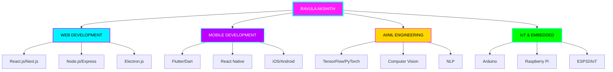

# <div align="center"></div>

<div align="center">

```ascii
    ╔══════════════════════════════════════════════════════════════════════════════╗
    ║   ██████╗ ███████╗ █████╗ ██╗     ██╗████████╗██╗   ██╗    ██╗  ██╗ ██████╗  ║
    ║   ██╔══██╗██╔════╝██╔══██╗██║     ██║╚══██╔══╝╚██╗ ██╔╝    ╚██╗██╔╝██╔═████╗ ║
    ║   ██████╔╝█████╗  ███████║██║     ██║   ██║    ╚████╔╝      ╚███╔╝ ██║██╔██║ ║
    ║   ██╔══██╗██╔══╝  ██╔══██║██║     ██║   ██║     ╚██╔╝       ██╔██╗ ████╔╝██║ ║
    ║   ██║  ██║███████╗██║  ██║███████╗██║   ██║      ██║       ██╔╝ ██╗╚██████╔╝ ║
    ║   ╚═╝  ╚═╝╚══════╝╚═╝  ╚═╝╚══════╝╚═╝   ╚═╝      ╚═╝       ╚═╝  ╚═╝ ╚═════╝  ║
    ║                                                                              ║
    ║          ⚡ FULL SPECTRUM ARCHITECT ⚡ AI × WEB × MOBILE × IoT ⚡          ║
    ╚══════════════════════════════════════════════════════════════════════════════╝
```

</div>

<p align="center">
  
</p>

<div align="center">

[](https://portfolio-five-theta-93.vercel.app/)
[](mailto:ravulaakshith1@gmail.com)
[](https://linkedin.com/in/ravulaakshith)
[](https://github.com/ravulaakshith)

</div>

---
<div align="center"> ## 🎯 『 DIMENSIONAL EXPERTISE MATRIX 』 🎯 </div> <table align="center"> <tr> <td width="25%" align="center"> ### 🌐 WEB UNIVERSE
javascript
const web = {
  frontend: "⚛️ React.js",
  backend: "🟢 Node.js",
  framework: "⚡ Express.js",
  reality: "🔮 Next.js"
};
**MASTERY: 95%**  ### 📱 MOBILE REALM
dart
class Mobile {
  String framework = "Flutter";
  List platforms = [
    "iOS", "Android", 
    "Cross-Platform"
  ];
}
 **MASTERY: 90%** </td> <td width="25%" align="center"> ### 🤖 AI DIMENSION
python
class AI_Engineer:
    def __init__(self):
        self.ml = True
        self.dl = True
        self.nlp = True
        self.vision = True
**MASTERY: 80%**  </td> <td width="25%" align="center"> ### 🔌 IoT NEXUS
cpp
void setup() {
  pinMode(REALITY, OUTPUT);
  digitalWrite(FUTURE, HIGH);
  Serial.begin(INNOVATION);
}
**MASTERY: 88%**  </td> </tr> </table>

---

<div align="center">

## ⚔️ 『 ULTIMATE TECH ARSENAL 』 ⚔️

</div>

<details open>
<summary><b>🎨 CLICK TO REVEAL FULL WEAPON CACHE 🎨</b></summary>

<br>

<div align="center">

### 『 🌊 FRONTEND OCEAN 』

<p align="center">
  
</p>

### 『 ⚙️ BACKEND FORTRESS 』

<p align="center">
  
</p>

### 『 📱 MOBILE & DESKTOP KINGDOMS 』

<p align="center">
  
</p>

### 『 🤖 AI/ML DIMENSION 』

<p align="center">
  
</p>

### 『 🔌 IoT & EMBEDDED REALM 』

<p align="center">
  
</p>

### 『 ☁️ CLOUD & DEVOPS UNIVERSE 』

<p align="center">
  
</p>

### 『 🛠️ TOOLS & UTILITIES 』

<p align="center">
  
</p>

</div>

</details>

---

<div align="center">

## 📊 『 QUANTUM PERFORMANCE ANALYTICS 』 📊

</div>


<div align="center">
  
  
</div>

<div align="center">
  
  
</div>

---

<div align="center">

## 🏆 『 LEGENDARY ACHIEVEMENTS VAULT 』 🏆

</div>

<div align="center">


</div>

---

<div align="center">

## 🎯 『 CURRENT MISSION OBJECTIVES 』 🎯

</div>

<table align="center">
<tr>
<td width="50%">

```typescript
interface CurrentProjects {
  primary: "🚀 AI-Powered SaaS Platform";
  secondary: "📱 Cross-Platform Mobile App";
  tertiary: "🏠 Smart IoT Home System";
  experimental: "🧠 Neural Network Visualizer";
  status: "IN_PROGRESS";
}

const innovationLevel = Infinity;
```

</td>
<td width="50%">

```python
class DailyRoutine:
    def __init__(self):
        self.activities = [
            "☕ Coffee++",
            "💻 Code",
            "🤖 Train Models",
            "🔧 Build Hardware",
            "🌙 Dream in Binary"
        ]
    
    def execute(self):
        while True:
            self.create_magic()
```

</td>
</tr>
</table>

---

<div align="center">

## 🌟 『 FEATURED MASTERPIECES 』 🌟

</div>

<div align="center">

<table>
<tr>
<td width="50%" align="center">


### 🤖 AI-POWERED ASSISTANT
**Full-Stack AI Application**

`React.js` • `Node.js` • `TensorFlow` • `MongoDB`

⭐ Real-time AI chat • Voice recognition • Smart automation

</td>
<td width="50%" align="center">


### 🏠 IoT HOME AUTOMATION
**Smart Home Control System**

`Flutter` • `Arduino` • `Firebase` • `ESP32`

⭐ Voice control • Mobile app • Real-time monitoring

</td>
</tr>
<tr>
<td width="50%" align="center">


### 📱 CROSS-PLATFORM REVOLUTION
**Universal Mobile Application**

`Flutter` • `Firebase` • `REST API` • `Redux`

⭐ iOS & Android • Beautiful UI • Cloud sync

</td>
<td width="50%" align="center">


### 💻 DESKTOP POWERHOUSE
**Native Desktop Application**

`Electron.js` • `React` • `SQLite` • `Node.js`

⭐ Cross-platform • High performance • Modern UI

</td>
</tr>
</table>

</div>

---

<div align="center">

## 💡 『 INNOVATION PHILOSOPHY 』 💡

</div>

<table align="center">
<tr>
<td align="center" width="25%">

### 🎯 FOCUS

```
Quality
   ↓
 Speed
   ↓
Innovation
```

</td>
<td align="center" width="25%">

### 🔄 ITERATE

```
Build
   ↓
 Test
   ↓
Improve
```

</td>
<td align="center" width="25%">

### 🚀 SCALE

```
 Local
   ↓
 Cloud
   ↓
 Global
```

</td>
<td align="center" width="25%">

### 🌟 IMPACT

```
 Code
   ↓
Product
   ↓
Reality
```

</td>
</tr>
</table>

---

<div align="center">

## 📈 『 CONTRIBUTION HEATMAP 』 📈

</div>

<div align="center">


</div>

---

<div align="center">

## 🎵 『 CODING SOUNDTRACK 』 🎵

</div>

<div align="center">

[](https://open.spotify.com/user/YOUR_SPOTIFY_ID)

</div>

---

<div align="center">

## 📊 『 WEEKLY DEVELOPMENT BREAKDOWN 』 📊

</div>

```text
TypeScript   12 hrs 45 mins  ████████████░░░░░░░░░   55.2%
Python        4 hrs 30 mins  ████░░░░░░░░░░░░░░░░░   19.5%
Dart          3 hrs 15 mins  ███░░░░░░░░░░░░░░░░░░   14.1%
C++           1 hr 25 mins   █░░░░░░░░░░░░░░░░░░░░    6.2%
Other         1 hr 10 mins   █░░░░░░░░░░░░░░░░░░░░    5.0%
```

---

<div align="center">

## 🌐 『 CONNECT ACROSS DIMENSIONS 』 🌐

</div>

<div align="center">

[](https://portfolio-five-theta-93.vercel.app/)
[](mailto:ravulaakshith1@gmail.com)
[](https://linkedin.com/in/ravulaakshith)
[](https://twitter.com/ravulaakshith)
[](https://instagram.com/ravulaakshith)
[](https://discord.com/users/YOUR_DISCORD_ID)
[](https://t.me/ravulaakshith)

</div>

---

<div align="center">

## 🎓 『 KNOWLEDGE DOMAINS 』 🎓

</div>

<table align="center">
<tr>
<td valign="top" width="50%">

### 💻 CORE COMPETENCIES

- ✅ Full-Stack Web Development
- ✅ Cross-Platform Mobile Apps
- ✅ Desktop Application Development
- ✅ AI/ML Model Development
- ✅ IoT & Embedded Systems
- ✅ Cloud Architecture & DevOps
- ✅ Database Design & Optimization
- ✅ API Design & Development
- ✅ Microservices Architecture
- ✅ Real-time Systems

</td>
<td valign="top" width="50%">

### 🛠️ SPECIALIZED SKILLS

- ⚡ Progressive Web Apps (PWA)
- ⚡ Server-Side Rendering (SSR)
- ⚡ WebSockets & Real-time Communication
- ⚡ Computer Vision & Image Processing
- ⚡ Natural Language Processing
- ⚡ Hardware Programming (Arduino)
- ⚡ Bluetooth & WiFi Protocols
- ⚡ CI/CD Pipeline Development
- ⚡ Performance Optimization
- ⚡ Security Best Practices

</td>
</tr>
</table>

---

<div align="center">

## 🎯 『 TECH STACK VISUALIZATION 』 🎯

</div>



---

<div align="center">

## 📫 『 GET IN TOUCH 』 📫

</div>

<div align="center">

```typescript
const contact = {
    name: "Ravula Akshith",
    role: "AI-Driven Full Stack Developer",
    email: "ravulaakshith1@gmail.com",
    portfolio: "https://portfolio-five-theta-93.vercel.app/",
    location: "India 🇮🇳",
    availability: "Open for opportunities",
    
    skills: {
        web: ["React", "Node.js", "Next.js", "Express"],
        mobile: ["Flutter", "React Native"],
        ai: ["TensorFlow", "PyTorch", "OpenCV"],
        iot: ["Arduino", "Raspberry Pi", "ESP32"],
        desktop: ["Electron.js"]
    },
    
    motto: "Building the future, one line of code at a time ⚡"
};
```

</div>

---

<div align="center">

### 🌟 VISITOR TRACKER 🌟


</div>

---

<div align="center">

```ascii
╔═══════════════════════════════════════════════════════════════════════════╗
║                                                                           ║
║     ██████╗  █████╗ ██╗   ██╗██╗   ██╗██╗      █████╗                    ║
║     ██╔══██╗██╔══██╗██║   ██║██║   ██║██║     ██╔══██╗                   ║
║     ██████╔╝███████║██║   ██║██║   ██║██║     ███████║                   ║
║     ██╔══██╗██╔══██║╚██╗ ██╔╝██║   ██║██║     ██╔══██║                   ║
║     ██║  ██║██║  ██║ ╚████╔╝ ╚██████╔╝███████╗██║  ██║                   ║
║     ╚═╝  ╚═╝╚═╝  ╚═╝  ╚═══╝   ╚═════╝ ╚══════╝╚═╝  ╚═╝                   ║
║                                                                           ║
║      █████╗ ██╗  ██╗███████╗██╗  ██╗██╗████████╗██╗  ██╗                 ║
║     ██╔══██╗██║ ██╔╝██╔════╝██║  ██║██║╚══██╔══╝██║  ██║                 ║
║     ███████║█████╔╝ ███████╗███████║██║   ██║   ███████║                 ║
║     ██╔══██║██╔═██╗ ╚════██║██╔══██║██║   ██║   ██╔══██║                 ║
║     ██║  ██║██║  ██╗███████║██║  ██║██║   ██║   ██║  ██║                 ║
║     ╚═╝  ╚═╝╚═╝  ╚═╝╚══════╝╚═╝  ╚═╝╚═╝   ╚═╝   ╚═╝  ╚═╝                 ║
║                                                                           ║
║            🚀 CRAFTING DIGITAL REALITIES SINCE 2020 🚀                    ║
║                                                                           ║
╚═══════════════════════════════════════════════════════════════════════════╝
```


</div>

---

<div align="center">

### 『 THE CODE IS MIGHTIER THAN THE SWORD 』

[](https://git.io/typing-svg)

</div>

---

<div align="center">

**⭐ Found something interesting? Star my repositories and let's build the future together! ⭐**

**💼 Open to freelance projects and full-time opportunities worldwide! 💼**

</div>
